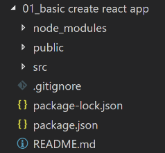
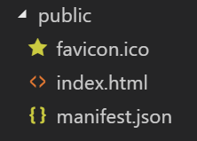
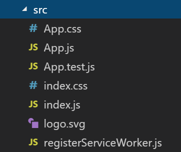

# `create-react-app` basic project structure
## Steps to create basic project:
* Install globally the `create-react-app` from npm:
```bash
npm i -g create-react-app
```
Now the `create-react-app` package is installed into `\AppData\Roaming\npm` 
* Create a new react project, with this command:
```bash
create-react-app "01_basic create react app"
```
This command will create a new folder named "01_basic create react app", with the following content:   

   

#### README.md
This file is for github documentation 
#### .gitignore
This file configs all the parts that will be ignored when we upload this project to github (the parts in this file are ignored)

#### package.json
This file configs the npm rules of this project

#### package-lock.json
package-lock.json is automatically generated for any operations where npm modifies either the node_modules tree, or package.json. It describes the exact tree that was generated, such that subsequent installs are able to generate identical trees, regardless of intermediate dependency updates.

#### node_modules
Packages are dropped into the node_modules folder under the prefix. When installing locally, this means that you can require("packagename") to load its main module, or require("packagename/lib/path/to/sub/module") to load other modules.

#### public
    
* favicon.ico - the icon that is used to the html tab
* index.html - the single html page of this SPA app
```html
<!DOCTYPE html>
<html lang="en">
  <head>
    <meta charset="utf-8">
    <meta name="viewport" content="width=device-width, initial-scale=1, shrink-to-fit=no">
    <meta name="theme-color" content="#000000">
  
    <link rel="manifest" href="%PUBLIC_URL%/manifest.json">
    <link rel="shortcut icon" href="%PUBLIC_URL%/favicon.ico">
    
    <title>React App</title>
  </head>
  <body>
   
    <div id="root"></div>
   
  </body>
</html>

```
#### src
    

#### registerServiceWorker.js
In production, we register a service worker to serve assets from local cache.

This lets the app load faster on subsequent visits in production, and gives it offline capabilities.

#### index.js
`ReactDOM.render` inserts the VD into `root` div in the `index.html` file

```javascript
import React from 'react';
import ReactDOM from 'react-dom';
import './index.css';
import App from './App';
import registerServiceWorker from './registerServiceWorker';

ReactDOM.render(<App />, document.getElementById('root'));
registerServiceWorker();
```

#### index.css
This css file is imported in the index.js file, and styles the current single html page

#### App.test.js
unit testing for App.js

#### App.js

```javascript
import React, { Component } from 'react';
import logo from './logo.svg';
import './App.css';

class App extends Component {
  render() {
    return (
      <div className="App">
        <header className="App-header">
          
          <h1 className="App-title">Welcome to React</h1>
        </header>
        <p className="App-intro">
          To get started, edit <code>src/App.js</code> and save to reload.
        </p>
      </div>
    );
  }
}

export default App;
```


#### App.css
This css file is imported in the App.js file, and styles the App compenent

#### logo.svg
This svg file is imported in the App.js file, and the svg image is displayed as src of img tag the App compenent


* Change the path in the command line to the project that you created in the prev step, and run it , with the following command:
```bash
npm start
```
The react app will run in localhost:3000

* We can delete 
    * node_modules
    * package-lock.json
and re-install them with this command:
```bash
npm i
```
