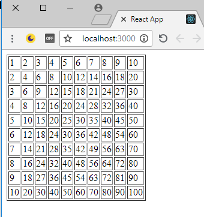

# create-react-app


## Run the app

* install all the npm packages with this command:
```bash
npm i
```
* run the app with this command:
```bash
npm start
```
* open the browser in http://localhost:3000 and see this result: 
---


